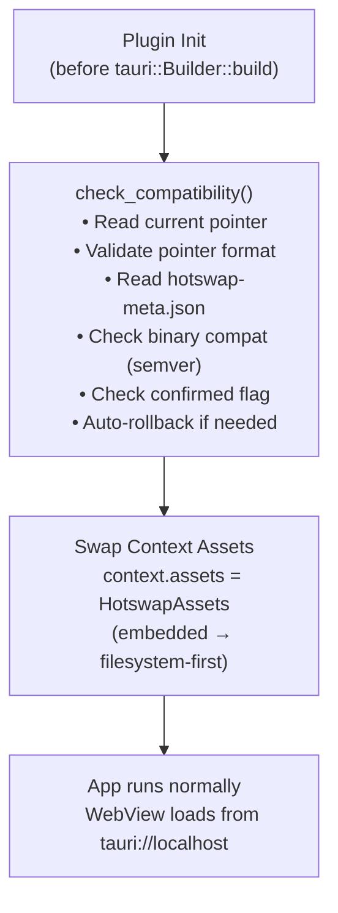
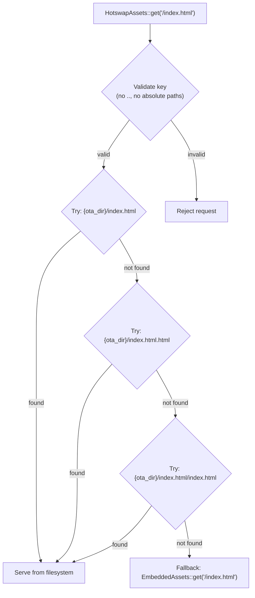
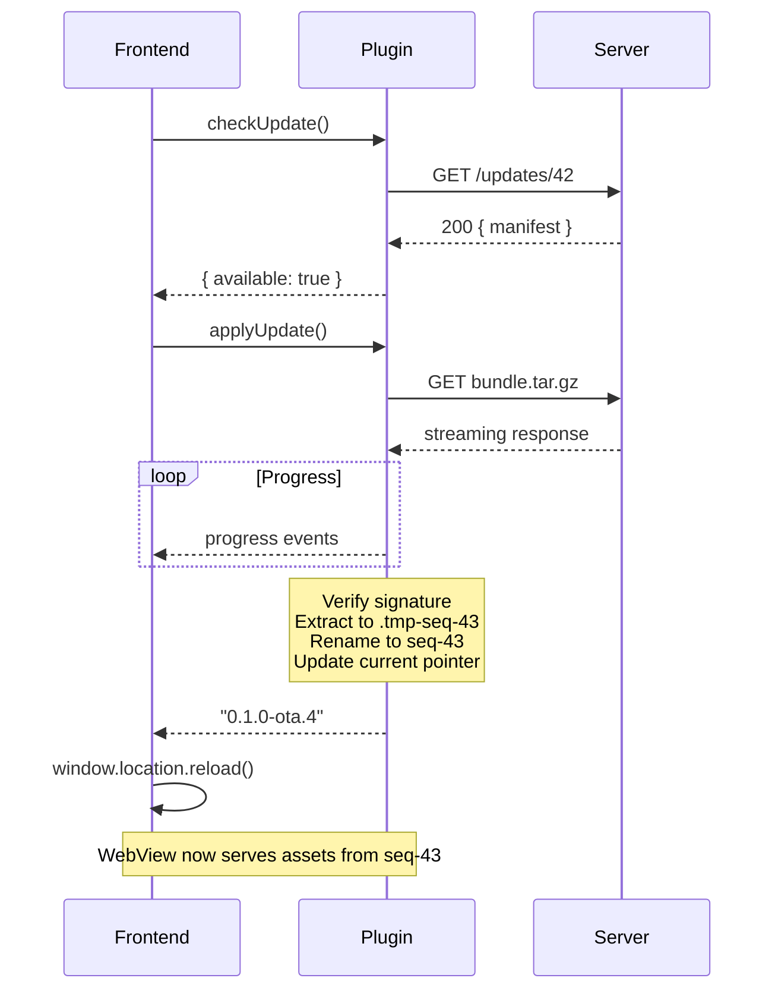
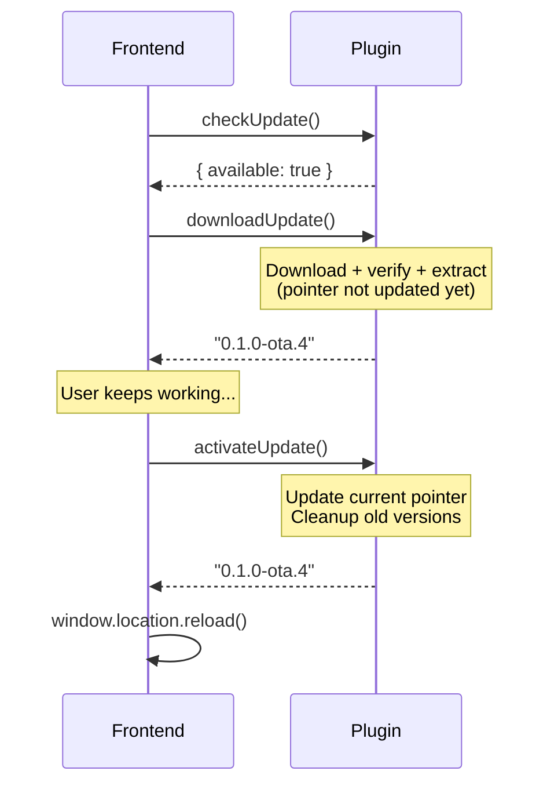

# 🏗️ Architecture

This document explains how `tauri-plugin-hotswap` works internally.

---

## Overview



---

## Filesystem Layout

```
{app_data_dir}/hotswap/
├── current                  # Text file containing "seq-42"
├── current.tmp              # Temp file for atomic pointer writes
├── seq-41/                  # Previous version (kept for rollback)
│   ├── index.html
│   ├── assets/
│   └── hotswap-meta.json
├── seq-42/                  # Current active version
│   ├── index.html
│   ├── assets/
│   └── hotswap-meta.json
└── .tmp-seq-43/             # In-progress extraction (cleaned up)
```

### `current` pointer

A plain text file containing the name of the active version directory (e.g. `seq-42`). Written atomically via temp file + rename.

### `hotswap-meta.json`

```json
{
  "version": "0.1.0-ota.3",
  "sequence": 42,
  "min_binary_version": "0.1.0",
  "confirmed": true
}
```

The `confirmed` field is the rollback heartbeat. Set to `false` on extraction, `true` when `notifyReady()` is called.

---

## Asset Resolution

When the WebView requests an asset (e.g. `/index.html`):



This means OTA bundles can be **partial** — any missing files fall through to the embedded assets.

---

## Update Flow

### Check → Apply (one-shot)



### Check → Download → Activate (split)



---

## Rollback Mechanism

### Automatic rollback (startup)

1. App starts → `check_compatibility()` runs
2. Reads `current` pointer → finds `seq-43`
3. Reads `hotswap-meta.json` → `confirmed: false`
4. **Rollback triggered**: deletes `seq-43`, finds `seq-42`
5. If `seq-42` is confirmed → activate it
6. If no confirmed version exists → fall back to embedded assets

### Manual rollback (JS API)

1. `rollback()` called
2. Reads current pointer → `seq-43`
3. Deletes `seq-43`
4. Finds highest remaining confirmed version → `seq-42`
5. Atomically updates pointer → `seq-42`

---

## Retry Strategy

Failed downloads use exponential backoff:

| Attempt | Delay | Total elapsed |
|---------|-------|---------------|
| 1st | 0s | 0s |
| 2nd | 1s | 1s |
| 3rd | 2s | 3s |
| 4th | 4s | 7s |

Configurable via `max_retries` (default 3, meaning 4 total attempts including the first).

---

## Version Retention

The plugin keeps **2 versions**: current + previous. All older versions are cleaned up after each apply. Leftover `.tmp-seq-*` directories from failed extractions are also cleaned.

---

## Runtime Configuration

Calling `configure()` from the JS API updates `Mutex`-guarded fields inside `HotswapState`. The fields available for runtime override are:

- `channel` — the update channel appended to check requests
- `endpoint` — the check URL (overrides the value from `tauri.conf.json`)
- `headers` — the full set of custom HTTP headers sent on check and download requests

Changes take effect on the next `checkUpdate()` call. No app restart is required. The state is held in memory only and is not persisted across app launches — if you need a channel or endpoint override to survive restarts, persist it yourself and call `configure()` again on startup.
