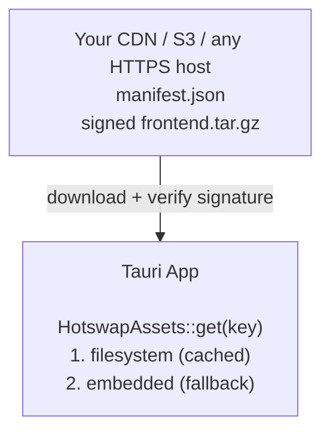

> This page mirrors the [GitHub README](https://github.com/denniskribl/tauri-plugin-hotswap). For the full docs, use the sidebar.

## What is this?

An **open-source Tauri v2 plugin** that pushes OTA frontend updates to users instantly — without rebuilding the native binary, without app store review, and without requiring a cloud service. Self-hosted, bring your own CDN.

It works by swapping Tauri's embedded asset provider at startup. The WebView keeps loading from `tauri://localhost` — the swap is invisible. Your keys, your server, your infrastructure. If anything goes wrong, the app rolls back to embedded assets on next launch.

### Platform Support

| Platform | Supported |
|----------|-----------|
| macOS    | ✅        |
| Windows  | ✅        |
| Linux    | ✅        |
| Android  | ✅        |
| iOS      | 🔜        |

### How it works



---

## Quickstart

### 1. Install

```toml
# src-tauri/Cargo.toml
[dependencies]
tauri-plugin-hotswap = "0.0.1"
```

```bash
npm install tauri-plugin-hotswap-api
```

### 2. Configure

Add to your `tauri.conf.json`:

```json
{
  "plugins": {
    "hotswap": {
      "endpoint": "https://your-server.com/api/updates/{{current_sequence}}",
      "pubkey": "<YOUR_MINISIGN_PUBKEY>"
    }
  }
}
```

### 3. Register the plugin

```rust
// src-tauri/src/lib.rs
pub fn run() {
    let context = tauri::generate_context!();
    let (hotswap, context) = tauri_plugin_hotswap::init(context)
        .expect("failed to initialize hotswap");

    tauri::Builder::default()
        .plugin(hotswap)
        .run(context)
        .expect("error running app");
}
```

### 4. Add capability

In `src-tauri/capabilities/default.json`:

```json
{
  "identifier": "default",
  "windows": ["main"],
  "permissions": [
    "core:default",
    "hotswap:default"
  ]
}
```

### 5. Use from the frontend

```typescript
import { checkUpdate, applyUpdate, notifyReady } from 'tauri-plugin-hotswap-api';

// Confirm current version works (call on every startup)
await notifyReady();

// Check for updates
const result = await checkUpdate();

if (result.available) {
  // Download, verify, and activate
  await applyUpdate();

  // Reload to serve new assets
  window.location.reload();
}
```

You can also change configuration at runtime:

```typescript
import { configure } from 'tauri-plugin-hotswap-api';

// Switch to a beta channel at runtime
await configure({ channel: 'beta' });
```

---

## Features

| Feature | Description |
|---------|-------------|
| **Signed bundles** | Every download is verified with minisign before extraction |
| **Auto-rollback** | If `notifyReady()` isn't called, the next launch rolls back automatically |
| **Channels** | Route users to `production`, `staging`, `beta` — switchable at runtime |
| **Custom headers** | Auth tokens, API keys — sent on every check and download request |
| **Retry with backoff** | Failed downloads retry automatically (1s → 2s → 4s → 8s) |
| **Download/activate split** | Download now, apply later — you control the timing |
| **Lifecycle events** | `hotswap://lifecycle` events for telemetry (Sentry, PostHog, etc.) |
| **Platform-aware** | Sends `platform`, `arch`, `channel` on every check request |
| **HTTPS enforced** | Non-HTTPS URLs rejected by default |
| **Atomic operations** | Temp dir extraction + rename for crash safety |
| **Custom resolvers** | `HotswapResolver` trait — bring your own update source |
| **Zip support** | Enable with `features = ["zip"]` |

---

## License

MIT OR Apache-2.0 (same as Tauri)
